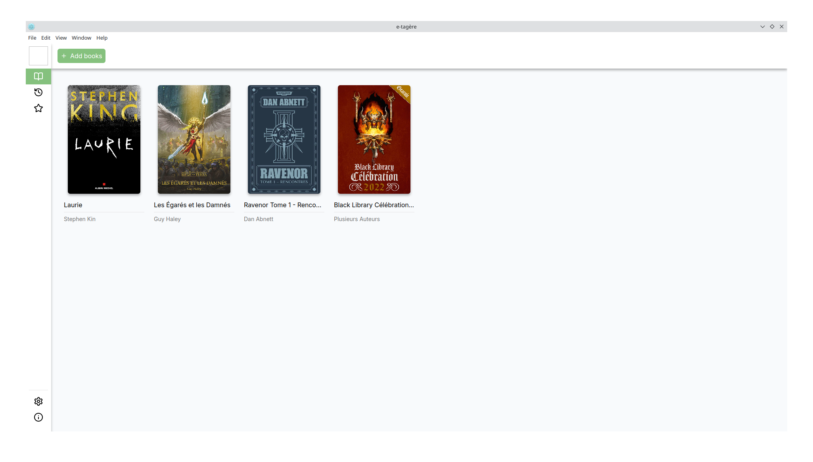

<h1 align="center">e-tagère</h1>

**e-tagère** is a simple e-book reader, built using **Electron** and **React**.

> **Note**: The image above is a preliminary version of the application and is still under development. The final design and features may differ significantly.
